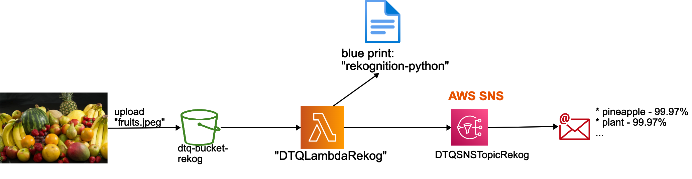
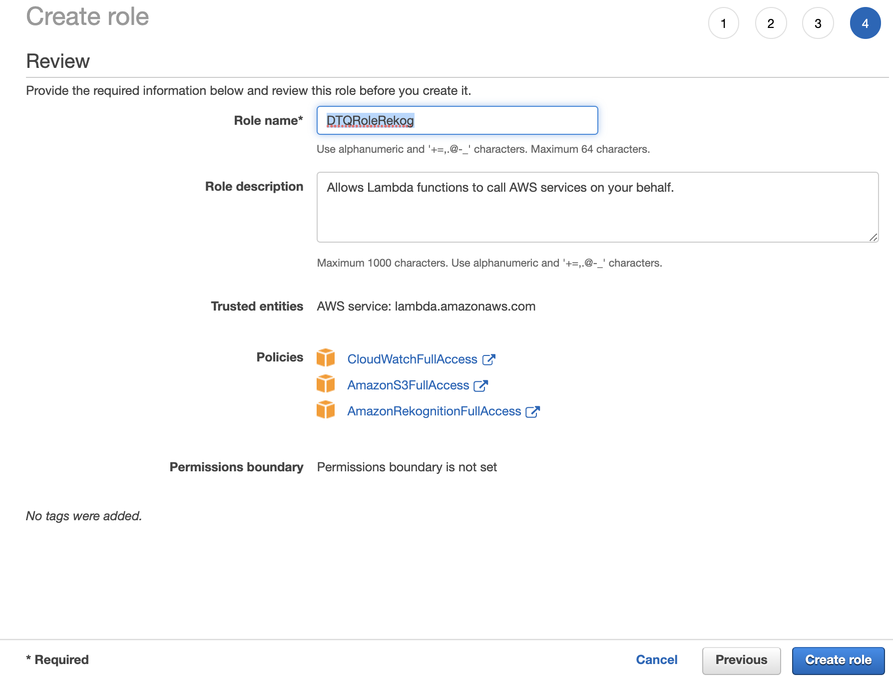
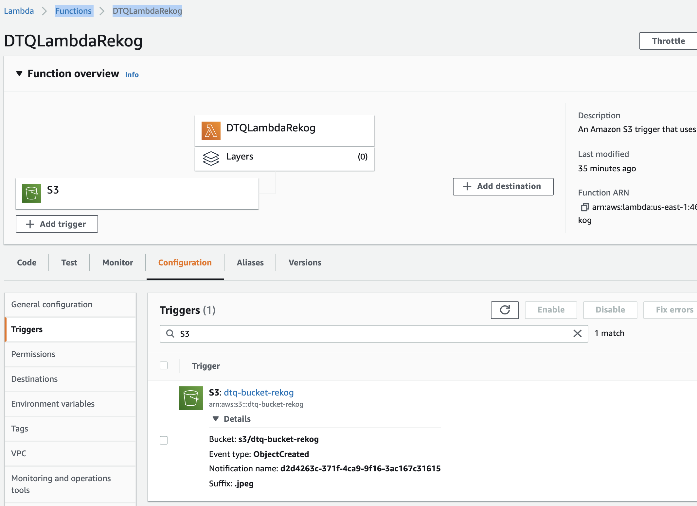
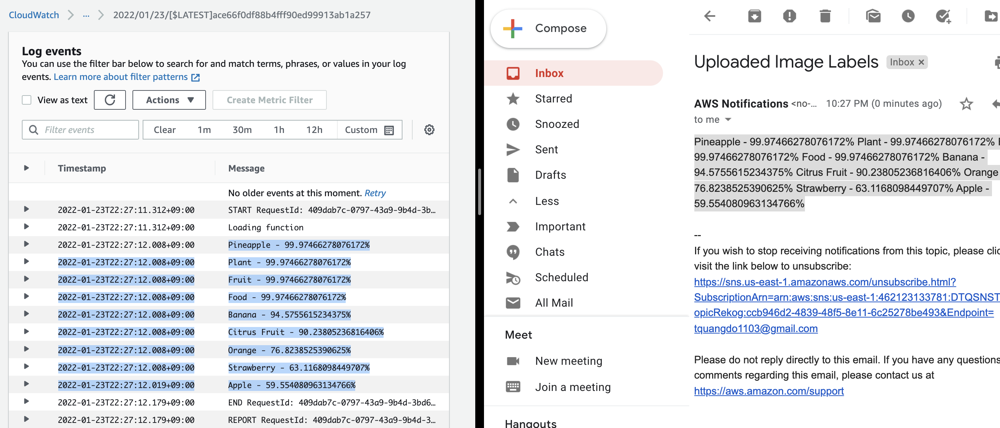

# aws-lambda-rekog-sns-s3-python 🐳

## reference
1. [youtube1](https://www.youtube.com/watch?v=wnTvVB1ojPk&t=3s)
2. [youtube2](https://www.youtube.com/watch?v=qoiqYwE7nfU&list=PLjCpH2Qpki-sTjdlYXE8AifSKQFa8ZL23&index=20)
> basically list/up/download/del bucket & object of S3. Code just in Youtube screenshot
3. [awsstudygroup](https://000060.awsstudygroup.com/3-gettingstartedwithawssdk/3.2-pythonandynamodb/)
> basically process with DynamoDB
 
## IAM role
- role name=`DTQRoleRekog`

## SNS
- topic name=`DTQSNSTopicRekog`
- subscription: email=`xxx@gmail.com` > confirm by email

## S3
- bucket name=`dtq-bucket-rekog`

## lambda
1. options=`blue print` > KW=`rekog`> choose `rekognition-python`
2. name=`DTQLambdaRekog`
3. role=`DTQRoleRekog`
4. bucket=`dtq-bucket-rekog`
5. Suffix=`.jpeg`
6. code: delete blue print default code: delete function has KW=`face` > add code for "sns"

- upload `images/fruits.jpeg` into `dtq-bucket-rekog`

